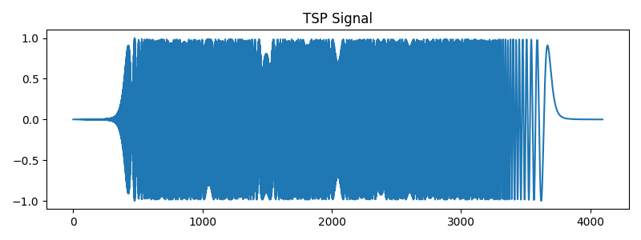
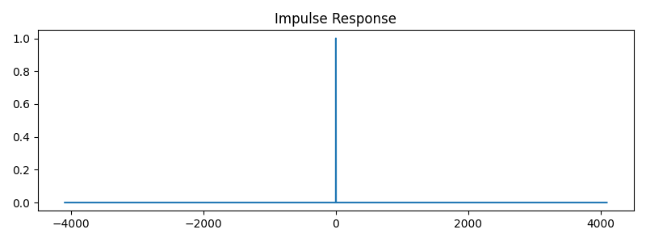

# OATSP for impulse-response measurement

A simple Python script for generating an Optimized Aoshima Time-Stretched Pulse (OATSP) and its inverse filter.

This code is intended for practical impulse-response measurement using audio devices such as loudspeakers, earphones, bone-conduction transducers, microphones, accelerometers, or other input/output systems.

## Files

```text
OATSP.py                  Main script
figures/tsp_signal.png    Example OATSP signal
figures/impulse_response.png  Example deconvolution result
README.md                 This file
```

## Required Python packages

The script uses common scientific Python packages:

```text
numpy
matplotlib
scipy
```

## Usage

Run the example:

```bash
python OATSP.py
```

The script generates:

- `TSP`: OATSP signal
- `INVTSP`: inverse filter for deconvolution

Basic use:

```python
TSP, INVTSP = generate_tsp(12)
ir = fftconvolve(recorded_signal, INVTSP)
```

In the example script, `recorded_signal` is replaced by `TSP` only to check that the TSP and inverse filter produce a sharp impulse-like response:

```python
ir = fftconvolve(TSP, INVTSP)
```

## Example output

Generated OATSP signal:



Deconvolution result obtained by convolving the OATSP signal with its inverse filter:



## Notes

- `generate_tsp(i)` uses `N = 2**i`.
- The current stretch map supports `9 <= i <= 16`.
- The stretch values are selected based on Fig. 7 of the original OATSP paper to keep the maximum error below approximately `-90 dB`.

## Reference

Suzuki, Y., Asano, F., Kim, H.-Y., & Sone, T. (1995). An optimum computer-generated pulse signal suitable for the measurement of very long impulse responses. *The Journal of the Acoustical Society of America, 97*(2), 1119–1123. https://doi.org/10.1121/1.412224
